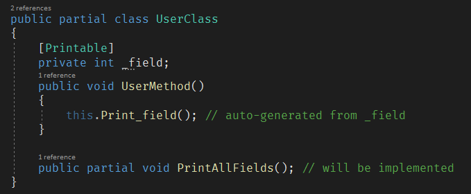

# Dotnetos Webinars - materials

Source code from various Dotnetos Webinars.

## [What do we like in C# 9?](https://www.youtube.com/watch?v=-ao0Tm5LseU)

[Sample C# source generator](src/CSharp9/SourceGenerators) for adding methods (for attributed fields) and implementing partial methods:

